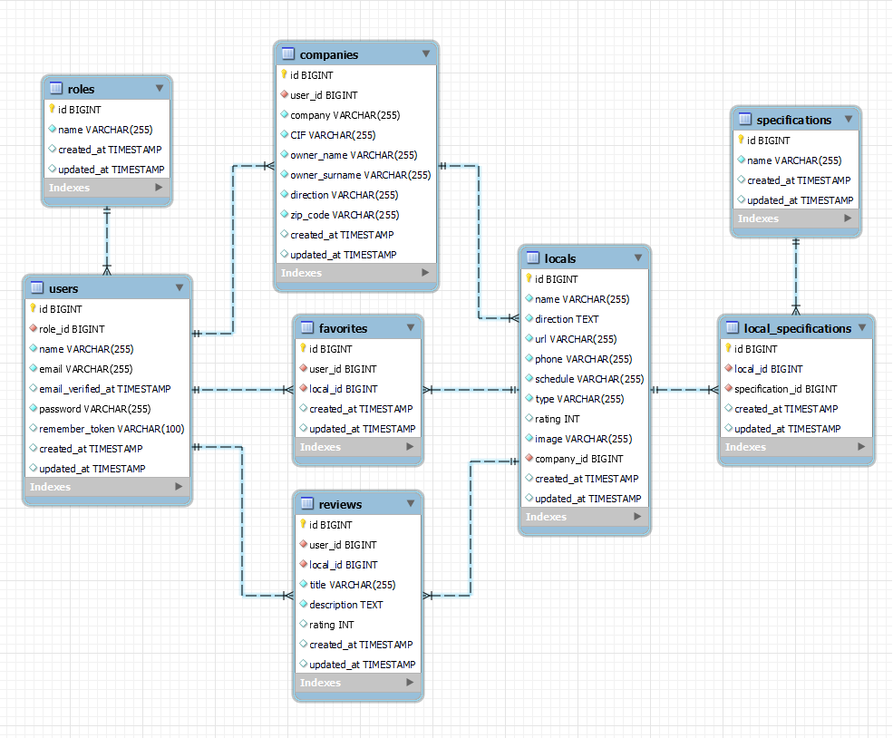

<h3 align="center"> ✨ HOOMAN BACKEND ✨</h3>

---

  
<b>Índice</b> 📝

  <ol>
    <li><a href="#proyecto">Proyecto</a></li>
    <li><a href="#stack">Stack</a></li>
    <li><a href="#diagrama-bd">Diagrama</a></li>
    <li><a href="#licencia">Licencia</a></li>
    <li><a href="#agradecimientos">Agradecimientos</a></li>
  </ol>

#### Proyecto

Este es el último proyecto realizado para el Bootcamp de Full Stack Developer en GeeksHubs Academy. Para el backend era necesario crear una base de datos MySQL y crear una API. Aunque ha sido la primera vez que implemento PHP y Laravel en un proyecto me ha sorprendido lo mucho que he disfrutado trabajando con este nuevo stack. 
Este proyecto pretende ser una aplicación para poder consultar qué locales de Valencia están adaptados a recibir entre sus comensales a sus mascotas. El usuario puede registrarse con el nombre de su mascota y añadir sus locales favoritos, además de filtrar por tipos de comida, buscar por nombre del local y añadir filtros de tipo de intolerancias o preferencias dieteticas. Todos los usuarios pueden dejar reseñas en los locales que consideres y ver tambien las reseñas que otros usuarios han dejado anteriormente. 

Cuenta demás con una vista para el Administrador. Este podrá ver las solicitudes de los usuarios para poder aparecer como locales en la aplicación. 

Échale un vistazo a mi frontend que le he dado mucho amor perruno: [HOOMAN](https://github.com/Coral-JM/cjm_fsd_frontend_hooman_proyecto_final)

---
#### Stack 

 

 

---

#### Diagrama

#### Licencia

Este proyecto ha sido realizado por Coral Jiménez, estudiante de GeeksHubs Academy en la promoción de primavera del 2023 y cuenta con una MIT License.

---
#### Agradecimientos

Como vengo haciendo desde casi las primeritas semanas, Judit ha sido la persona que más se ha ganado el cielo por aguantar mis risas y mis llantos durante todos estos meses. Id a visitar su gitHub si queréis disfrutar de su trabajo porque es una de las grandes. 

**Judit Grau** 

